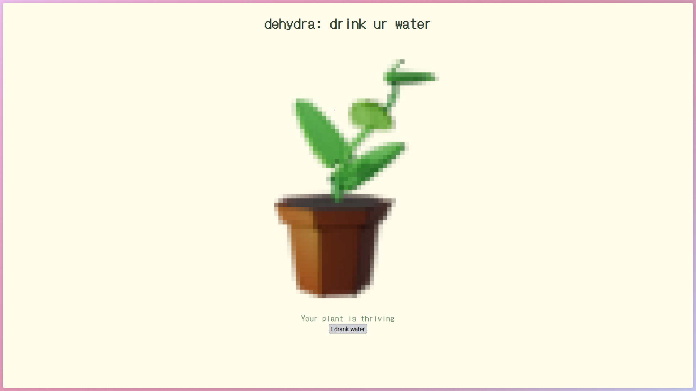
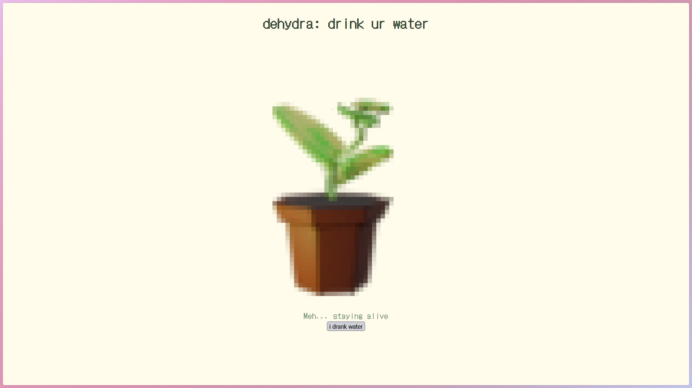
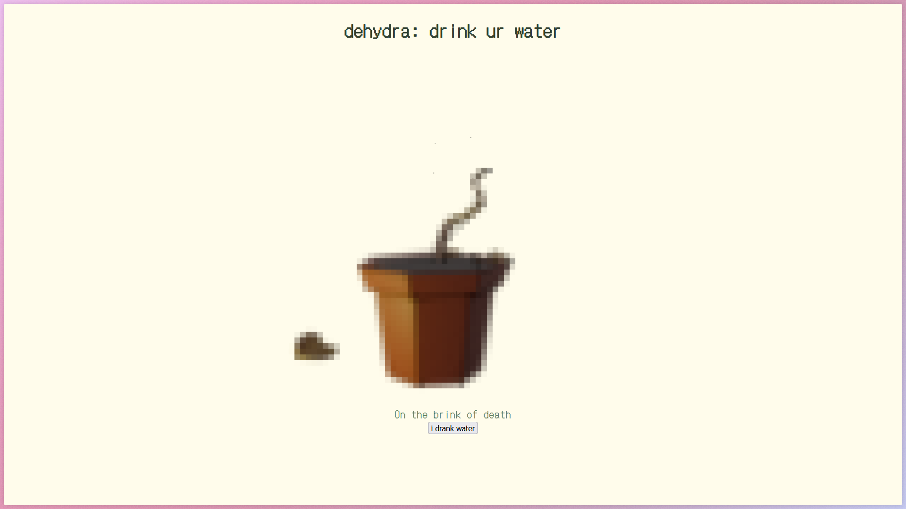

# DeHydra 🎯

## **Basic Details**
**Team Name:** 3D Fundas  

**Team Members**  
- **Team Lead:** Nehil – Christ College of Engineering, Irinjalakuda
- **Member 2:** Shravan – Christ College of Engineering, Irinjalakuda

---

## **Project Description**
DeHydra is a *passive-aggressive hydration webapp* where failing to drink water slowly kills a group of quirky pixel plants in a terrarium.  
Each plant has moods that degrade over time if you don’t log your water intake — complete with guilt-tripping messages and dramatic withering animations.  

---

## **The Problem (that doesn’t exist)**  
People ignore polite hydration reminders. The *real* issue? Lack of judgmental pixel plants silently watching you ruin their tiny green lives.  

---

## **The Solution (that nobody asked for)**  
We guilt-trip you into drinking water by tying the health of adorable yet emotionally manipulative digital plants to your hydration habits.  
Forget badges — here you get:  
- Withered leaves 
- A Dead Plant 

---

## **Technical Details**  

### **For Software:**  
- **Languages:** HTML, CSS, JavaScript  
- **Frameworks:** None (Vanilla JS for guilt in its purest form)  
- **Libraries:** Google Fonts (DotGothic16), optional anime.js for smooth animations  
- **Tools:** VS Code, GitHub Pages / Netlify for deployment  

### **For Hardware:**  
- None (unless you count the emotional hardware of your conscience)  

---

## **Implementation**  

### **For Software:**  

#### Installation
```bash
    git clone https://github.com/niceplant/Dehydra.git
    cd DeHydra
```





 ### **Diagram:**
[ LOG WATER ]

↓

[ UPDATE PLANT STATE ]

↓

[ ANIMATE CHANGES ]


## 🎥 Project Demo

**Video Demo:** <video controls src="videodemo.mp4" title="Title"></video> — Shows plants reacting in real-time to water logging and degrading over 5-second intervals for testing.
---

## 👨‍💻 Team Contributions

- **Nehil:** UI design, pixel art placeholders, mood animations.  
- **Shravan:** Core logic for hydration tracking, plant state decay system, plant personalities.


Made with ❤️ at TinkerHub Useless Projects
